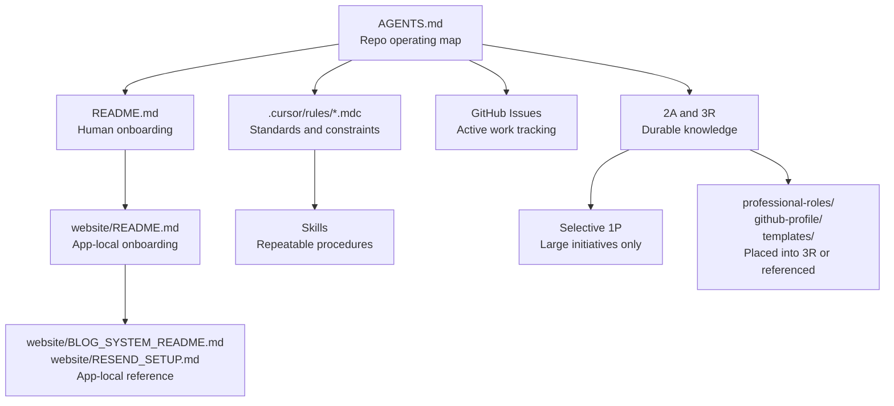

# Build A Lean Repo AOS

## Goal

Turn the repo into a clean agent operating system with one clear documentation hierarchy, minimal duplication, and GitHub Issues as the default work-management layer. The result should make `AGENTS.md` the entrypoint, keep README files focused on onboarding, use `.cursor/rules/*.mdc` for durable standards, reserve skills for repeatable workflows, and slim PARA down to long-lived knowledge.

## Proposed Documentation Hierarchy




### Source-of-truth order

When docs conflict, the higher-ranked source wins:

1. `AGENTS.md` -- repo operating map
2. `.cursor/rules/*.mdc` -- enforceable standards
3. App-local READMEs (`README.md`, `website/README.md`, `website/BLOG_SYSTEM_README.md`)
4. `2A` / `3R` -- supplementary reference material
5. `1P` -- strategic initiative context (not standards)

### Boundary between rules and knowledge

- `.cursor/rules/*.mdc` = standards and constraints that agents must follow.
- `2A` / `3R` = supplementary reference that supports the rules but never overrides them. If a `2A`/`3R` doc restates a rule, the rule is authoritative and the duplicate should be removed or reduced to a pointer.

## What Needs To Change

- Promote [AGENTS.md](AGENTS.md) to the explicit top-level contract for repo architecture, doc hierarchy, and maintenance triggers.
- Rewrite [README.md](README.md) into a concise human onboarding guide and remove stale architecture/workflow history.
- Rewrite [website/README.md](website/README.md) so it reflects the current Next.js 14 app, current content pipeline, and local commands only.
- Refactor the rule set in [.cursor/rules/](.cursor/rules/) so each rule has one job, no rule restates onboarding material, and overlapping rules are merged or removed.
- Fix `.mdc` frontmatter placement (currently at end of file on all rules; must be at top for glob scoping and `alwaysApply` to work).
- Deprecate [RULES.md](RULES.md) after migrating any remaining useful guidance.
- Place orphaned docs that sit outside the hierarchy into their correct tier.
- Replace markdown-based work tracking with GitHub Issues and trim `1P` to strategic, multi-issue initiatives only.
- Draw a clear boundary between rules (standards) and `2A`/`3R` (reference), and remove duplicate docs in `2A`/`3R` that restate rules.
- Create one initial skill so the Skills layer is not an empty promise.

## Evidence Of Drift To Correct

### Stale architecture in READMEs

`README.md` still describes an obsolete sync workflow and `website/posts/` publishing model:

```
# from README.md lines 140-175
npm run content:sync
...
1. Write in content/blog/ (organized by ZAG)
2. Sync to website/posts/ for publishing
```

`website/README.md` still describes Next 13, Contentlayer, and `posts/` as the content home:

```
# from website/README.md lines 36-52
website/
+-- app/                    # Next.js 13 app directory
...
+-- posts/                 # Blog content (MDX files)
+-- contentlayer.config.ts # Content management config
```

### Stale architecture in rules

Both `nextjs-architecture.mdc` and `content-strategy.mdc` reference Contentlayer and `website/posts/`:

```
# nextjs-architecture.mdc lines 58-62
- Use MDX for blog posts in [posts directory](mdc:website/posts/)
- Use Contentlayer for content processing

# content-strategy.mdc lines 10-14
- Use MDX for blog posts in [posts directory](mdc:website/posts/)
- Use Contentlayer for content processing
```

### Overlapping rules

- `ci-cd-workflow.mdc` duplicates nearly all of `testing-deployment.mdc` (GitOps, deploy process, quality gates, Vercel).
- `vercel-config-location.mdc` is a narrow single-topic rule that fits as a section in `testing-deployment.mdc` or `nextjs-architecture.mdc`.
- `script-automation.mdc` references obsolete scripts (`sync-content.js`, Slack automation, channel-creation scripts).

### PARA doing work tracking

```
# para-system.mdc lines 31-36
Each project should include:
- README.md, YYYYMMDD-project-brief.md, YYYYMMDD-status-tracker.md, YYYYMMDD-COMPLETED.md
```

### Broken .mdc frontmatter

Every `.mdc` rule file has its YAML frontmatter at the **end** of the file instead of the top:

```
# core-standards.mdc lines 59-62
description:
globs:
alwaysApply: false
---
```

This means no rule currently has working glob scoping or `alwaysApply` configuration.

### Orphaned docs outside the hierarchy

These files are not referenced by `AGENTS.md`, any README, or any rule:

- `website/BLOG_SYSTEM_README.md` -- accurate blog system docs, but no owner in the hierarchy
- `website/RESEND_SETUP.md` -- Resend email setup guide
- `website/public/ASSETS_README.md` -- required image assets with stale status info
- `professional-roles/` -- 3 role descriptions outside PARA
- `github-profile/` -- GitHub profile README and setup guide outside PARA
- `templates/bio-templates/` -- bio templates at repo root, separate from `3R/templates/`

### 2A/3R docs that duplicate rules

- `2A/technical-maintenance/testing-strategy.md` overlaps `testing-deployment.mdc`
- `2A/technical-maintenance/deployment-process.md` overlaps `ci-cd-workflow.mdc`
- `2A/content-creation/content-strategy.md` overlaps `content-strategy.mdc`
- `3R/docs/collaboration/cursor-strategy.md` overlaps `collaboration-standards.mdc`
- `3R/docs/collaboration/para-system-guide.md` overlaps `para-system.mdc`

## Target End State By File

### Repo entrypoints

- [AGENTS.md](AGENTS.md)
  - Keep as the authoritative operating map.
  - Add a "documentation hierarchy" section with the source-of-truth order.
  - Add a "doc maintenance triggers" section listing when docs must be updated.
  - Replace references that treat `RULES.md` as equal authority.
  - Reference orphaned docs that remain outside PARA (e.g. `professional-roles/`, `github-profile/`).
- [README.md](README.md)
  - Reduce to quick start, repo map, core commands, and links to `AGENTS.md` and `website/README.md`.
  - Remove strategy prose, stale workflow docs, and duplicated standards.
- [website/README.md](website/README.md)
  - Reframe as app-local onboarding only: dev/build/test commands, app structure, env pointers, and content entrypoints.
  - Link to `website/BLOG_SYSTEM_README.md` and `website/RESEND_SETUP.md` as app-local reference rather than restating their content.

### Standards layer (rules)

Target rule set (7 rules, down from 9):

- [.cursor/rules/README.md](.cursor/rules/README.md)
  - Document the rule map: which rule to update for which kind of change.
- [.cursor/rules/core-standards.mdc](.cursor/rules/core-standards.mdc)
  - Coding and quality standards only: strict TS, accessibility, mobile-first, icon rule, naming conventions. Update "Next.js 13+" to "Next.js 14".
- [.cursor/rules/nextjs-architecture.mdc](.cursor/rules/nextjs-architecture.mdc)
  - Next.js 14, App Router, RSC-first, `website/lib/posts.ts` / `content/blog/` content pipeline, metadata guidance. Remove all Contentlayer and `website/posts/` references.
- [.cursor/rules/testing-deployment.mdc](.cursor/rules/testing-deployment.mdc)
  - Absorb `ci-cd-workflow.mdc` and `vercel-config-location.mdc`. Cover local-first Playwright, CI expectations, GitOps deploy, Vercel config location, and env management in one file.
- [.cursor/rules/content-strategy.mdc](.cursor/rules/content-strategy.mdc)
  - ZAG content structure and editorial rules only. Remove Contentlayer and `website/posts/` references.
- [.cursor/rules/collaboration-standards.mdc](.cursor/rules/collaboration-standards.mdc)
  - Narrow to collaboration, handoff, decision logging, and repo hygiene.
- **New:** [.cursor/rules/agentic-workflows.mdc](.cursor/rules/agentic-workflows.mdc)
  - Planning before editing, issue-driven execution, doc-update triggers, how agents keep repo knowledge synchronized, how to handle stale docs discovered during implementation.
- [.cursor/rules/para-system.mdc](.cursor/rules/para-system.mdc)
  - Slim to a knowledge-placement rule: where to put durable reference (`2A`/`3R`), when `1P` is justified, and the boundary between rules and knowledge docs. Remove project-management ceremony.

Rules to remove:

- `ci-cd-workflow.mdc` -- merged into `testing-deployment.mdc`
- `vercel-config-location.mdc` -- merged into `testing-deployment.mdc`
- `script-automation.mdc` -- obsolete script references; remove or gut to only cover scripts that still exist

All `.mdc` files must have frontmatter **at the top** of the file with correct `description`, `globs`, and `alwaysApply` values.

### Legacy docs

- [RULES.md](RULES.md)
  - Migrate remaining useful guidance (icon rule, naming conventions) to `core-standards.mdc`.
  - Replace with a short deprecation stub pointing to `AGENTS.md` and `.cursor/rules/`, or delete entirely.

### Orphaned docs

- `website/BLOG_SYSTEM_README.md` -- keep in place; link from `website/README.md`. Already accurate.
- `website/RESEND_SETUP.md` -- keep in place; link from `website/README.md` as app-local setup reference.
- `website/public/ASSETS_README.md` -- review for staleness; keep as app-local asset checklist or archive if all assets are now in place.
- `website/public/downloads/README.md` -- keep as-is (small, accurate placeholder note).
- `professional-roles/` -- move to `3R/professional-roles/` or keep at root and reference from `AGENTS.md`.
- `github-profile/` -- move to `3R/github-profile/` or keep at root and reference from `AGENTS.md`.
- `templates/bio-templates/` -- consolidate with `3R/templates/` (currently a separate root-level folder duplicating the PARA pattern).

### Work management

- Add GitHub-native issue templates under `.github/ISSUE_TEMPLATE/`:
  - `feature.yml`
  - `bug.yml`
  - `content.yml`
  - `config.yml` (chooser config)
- Document a lightweight label taxonomy in `agentic-workflows.mdc` or `collaboration-standards.mdc`:
  - Type labels: `type:feature`, `type:bug`, `type:content`, `type:chore`
  - Area labels: `area:website`, `area:docs`, `area:seo`, `area:content`
  - Priority labels: `priority:p1`, `priority:p2`
  - ZAG pillar labels: `pillar:zen`, `pillar:act`, `pillar:gem`

### Knowledge base cleanup

- **1P**: Keep only `brand-dial-in/` (durable decisions + publish checklist). Archive or delete `sean-onboarding/`, `slack-community-setup/`, `about-page-refinement/`, and `brand-ecosystem-project-tracker.md` -- these are issue-sized or completed work.
- **2A**: Keep, but remove docs that duplicate `.cursor/rules` content. `testing-strategy.md`, `deployment-process.md`, and `content-strategy.md` should become pointers to their `.mdc` counterparts or be deleted.
- **3R**: Keep reference material. Remove `docs/collaboration/para-system-guide.md` and `docs/collaboration/cursor-strategy.md` if they duplicate the rules. Absorb `templates/bio-templates/` from repo root. Consider moving `professional-roles/` and `github-profile/` here.
- **4A**: Keep as-is. No action needed; archive is already historical.

### Initial skill

Create one skill to prove the pattern: **"Create a new blog post from a ZAG brief."**

This skill should walk through:

1. Choosing the right `content/blog/<pillar>/` directory
2. Generating correct frontmatter (title, description, date, category, author, tags)
3. Placing images in `website/public/images/blog/<post-slug>/`
4. Verifying the post renders locally

Place in `.cursor/skills/create-blog-post/SKILL.md`.

## Execution Phases

### Phase 1: Establish the hierarchy

1. Rewrite `AGENTS.md` with the documentation hierarchy, source-of-truth order, and maintenance triggers.
2. Rewrite root `README.md` as concise onboarding.
3. Rewrite `website/README.md` as app-local onboarding.
4. Deprecate `RULES.md` (migrate icon rule + naming conventions to `core-standards.mdc` first).

### Phase 2: Modernize the standards layer

1. Fix `.mdc` frontmatter placement on all rule files (move YAML block from bottom to top).
2. Modernize `core-standards.mdc`, `nextjs-architecture.mdc`, `content-strategy.mdc`, and `collaboration-standards.mdc` to reflect current architecture.
3. Merge `ci-cd-workflow.mdc` and `vercel-config-location.mdc` into `testing-deployment.mdc`, then delete the originals.
4. Gut or remove `script-automation.mdc`.
5. Create `agentic-workflows.mdc` with planning, issue-driven execution, and doc-update trigger guidance.
6. Rewrite `para-system.mdc` as a slim knowledge-placement rule.
7. Update `.cursor/rules/README.md` to reflect the new rule map.

### Phase 3: Place orphaned docs and clean knowledge

1. Decide placement for each orphaned doc (`BLOG_SYSTEM_README.md`, `RESEND_SETUP.md`, `ASSETS_README.md`, `professional-roles/`, `github-profile/`, `templates/bio-templates/`).
2. Audit `2A` and `3R` for docs that duplicate rules. Remove or demote duplicates.
3. Archive or delete issue-sized `1P` folders and the markdown project tracker.

### Phase 4: Shift work management to GitHub Issues

1. Create GitHub issue templates (`feature.yml`, `bug.yml`, `content.yml`, `config.yml`).
2. Document the label taxonomy in the appropriate rule or README.
3. Retire `1P/brand-ecosystem-project-tracker.md` and `3R/docs/project-management/todo-system-guide.md`.

### Phase 5: Create initial skill and validate

1. Create `.cursor/skills/create-blog-post/SKILL.md`.
2. Grep the repo for stale references: `Contentlayer`, `website/posts/`, `content:sync`, `Next.js 13`.
3. Confirm all `.mdc` frontmatter is at the top of file with correct `description`, `globs`, and `alwaysApply`.
4. Spot-check agent orientation: does a fresh agent reading only `AGENTS.md` know where to look for everything?

## Success Criteria

- `AGENTS.md` clearly establishes the repo's documentation hierarchy and source-of-truth order.
- Root and website README files are current, concise, and non-overlapping.
- No active rule or README mentions Contentlayer, `website/posts/`, `content:sync`, or `Next.js 13` as the current architecture.
- All `.mdc` files have frontmatter at the top with correct `description`, `globs`, and `alwaysApply` values.
- The rule set is consolidated to 7 focused rules (down from 9) with no overlapping scope.
- `RULES.md` is no longer a parallel authority.
- Every doc in the repo has a clear home in the hierarchy; no orphaned doc islands.
- `2A`/`3R` docs supplement rules but do not restate them.
- PARA remains only for durable knowledge; GitHub Issues is the default place for active work.
- The repo has an explicit agent workflow standard, GitHub issue templates, and at least one working skill.
- A validation grep confirms zero stale architecture references in active docs.

