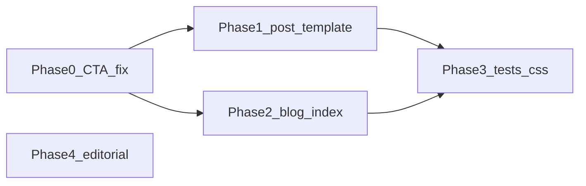

# Blog layout, newsletter-first conversion, and content tightening

## Goals

- **Reading UX:** Narrower measure, calmer heading scale, more vertical rhythm aligned with a minimalist, high-signal blog.
- **North Star:** Newsletter signup should be the **primary** action after a post; framework exploration stays visible as secondary.
- **Tracking:** Every blog-origin newsletter CTA should carry a distinct `ctaSource` so conversion paths are measurable.
- **Content (optional phase):** Cut redundancy and corporate-adjacent phrasing in key posts without changing factual attribution.
- **Delivery discipline:** Implement in a feature branch, validate with local + CI tests, then promote through GitHub Actions/Vercel pipeline to production.

## Branch and release workflow (required)

1. **Branch-first implementation**
  - Create a dedicated branch from `main` (for example: `feat/blog-newsletter-first-refinement`).
  - Do all UI/content/test work in that branch; no direct commits to `main`.
2. **Pre-PR local quality gate**
  - Run targeted checks before opening PR: app build, blog E2E/spec coverage, and any touched tests.
  - If failures occur, fix in-branch before PR creation.
3. **PR and CI gate**
  - Open PR from feature branch into `main`.
  - Require GitHub Actions to pass (Playwright and deploy workflow checks as configured).
  - Address review feedback in the same branch.
4. **Promotion to production**
  - Merge PR to `main` only after checks are green.
  - Confirm deployment completes via pipeline and validate production smoke checks (blog page load, post page load, newsletter CTA navigation with `cta` query).

## Current baseline (what changes)

- Post template: `[website/app/blog/[slug]/page.tsx](website/app/blog/[slug]/page.tsx)` -- full width `max-w-4xl` for body; `h2` at `text-3xl` competes with title; **category appears twice** (pill + Tag row); bottom CTA puts **Explore the Framework** before **Subscribe**; current markup wraps a button-rendering component inside `Link`, which should be corrected as part of the CTA pass.
- Index: `[website/app/blog/page.tsx](website/app/blog/page.tsx)` -- dense 3-column cards, gradient-heavy sections; bottom block already puts newsletter first, but it links to `/newsletter` without tracked attribution.
- Reusable pieces: `[website/components/NewsletterSignup.tsx](website/components/NewsletterSignup.tsx)` (`compact` variant exists); `[website/components/NewsletterCTA.tsx](website/components/NewsletterCTA.tsx)` for `/newsletter?cta=...` attribution; `[website/components/ui/cta-button.tsx](website/components/ui/cta-button.tsx)` currently renders a `<button>`. **Both `NewsletterCTA` and `CTAButton` nest a `<button>` inside `Link`** -- this invalid HTML must be fixed before they are used in new placements.
- Shared card: `[website/components/BlogCard.tsx](website/components/BlogCard.tsx)` is used by `[website/components/LatestInsights.tsx](website/components/LatestInsights.tsx)` on the homepage, but the blog index inlines its own card markup. Refactor the index to use `BlogCard` so styling stays consistent.
- Global blog styles duplicate markdown styling in `[website/app/globals.css](website/app/globals.css)` (`.blog-content`); live post body styling is driven mainly by **ReactMarkdown `components`** in `[slug]/page.tsx` -- keep one source of truth or sync intentionally.

## Phase 0 -- Fix CTA components (prerequisite)

Refactor shared CTA components so they produce valid HTML before using them in new placements.

1. `[NewsletterCTA](website/components/NewsletterCTA.tsx)` -- currently wraps `<Button>` (a `<button>`) inside `<Link>` (an `<a>`). Change to render an anchor-styled element: either make `Button` accept an `as="a"` prop, or have `NewsletterCTA` render a styled `Link` directly.
2. `[CTAButton](website/components/ui/cta-button.tsx)` -- same nested-interactive pattern on the post page. Either add an anchor variant or stop using it for navigation and use styled `Link` elements.
3. `[Button](website/components/ui/button.tsx)` -- update here if you choose the polymorphic approach; otherwise no changes needed.

## Phase 1 -- Post page (highest impact)

1. **Typography and measure**
  - Wrap markdown output in a container with `max-w-[65ch] mx-auto` (title/meta stays in `max-w-4xl`).
  - Wide content breakout: apply `max-w-none` to `<pre>`, `<table>`, and `` inside the narrow wrapper so code blocks, tables, and images are not clipped.
  - Body: `text-[17px] sm:text-lg`, `leading-[1.75]`.
  - Downshift in-article headings vs page title: `h2` to `text-2xl` / `font-semibold`, increase top margin (`mt-12` to `mt-14`).
  - Lists: consider `list-outside` + `pl-5` for cleaner left edge (optional polish).
2. **Meta cleanup**
  - Remove duplicate category: keep pill **or** Tag line in the byline, not both.
3. **Newsletter CTA placement**
  - Move the newsletter CTA block to appear **immediately after the article body**, before `AboutAuthor` and tags. This reduces friction between reading and subscribing.
  - Use the refactored `NewsletterCTA` (Phase 0) with `ctaSource="blog_post_footer"`.
  - Swap order: **Subscribe to The ZAG Navigator** first (primary); **Explore the Framework** second (outline).
  - Tighten headline and subcopy to one line promise.
4. **Mid-post touchpoint**
  - Render the refactored `NewsletterCTA` with `ctaSource="blog_post_mid"`.
  - Defer inline form capture to a later phase.

## Phase 2 -- Blog index

1. **Refactor to use BlogCard**
  - Replace inline card markup in `[website/app/blog/page.tsx](website/app/blog/page.tsx)` with the shared `[BlogCard](website/components/BlogCard.tsx)` component.
  - Apply calmer chrome to `BlogCard` itself: lighter border, `shadow-none` or subtle hover only, increased padding (`p-8`).
  - This keeps the homepage `LatestInsights` cards visually consistent with the blog index.
2. **Grid density**
  - Consider **2 columns max** on `lg` (or single column with wider cards) so titles and descriptions breathe -- tradeoff: more scroll.
3. **Hero / section copy**
  - Shorten subtitle under "The ZAG Blog" and the "All Articles" blurb to one high-signal line each (newsletter-angled if you want consistency with North Star).
  - Out of scope for now: homepage `LatestInsights` subtitle ("Practical wisdom for your transformation journey") -- flag for a future pass if the voice diverges after index copy is tightened.
4. **Featured band**
  - Keep structure; optionally reduce gradient noise to match minimalist direction (flat `bg-white` + border).
5. **Tracked newsletter CTA**
  - Replace raw `/newsletter` links on the blog index with the refactored `[NewsletterCTA](website/components/NewsletterCTA.tsx)` or equivalent tracked links.
  - Use explicit sources such as `blog_index_footer` and `blog_post_footer` so blog placements can be compared later.

## Phase 3 -- Consistency and tests

1. **CSS duplication**
  - Either document that `.blog-content` in `globals.css` is legacy for non-ReactMarkdown pages, or align tokens (font sizes / spacing) with `[slug]/page.tsx` overrides so future edits are not split-brained.
2. **Playwright**
  - Add explicit assertions in `[tests/e2e/blog.spec.js](tests/e2e/blog.spec.js)` for:
    - post-page primary CTA navigates to `/newsletter`
    - newsletter links from blog surfaces preserve `?cta=...`
    - framework CTA remains present as the secondary action
  - Update any CTA-specific tests only if selectors or copy changes break them.
3. **Pipeline verification**
  - After PR is opened, verify CI status for Playwright and deployment workflows.
  - After merge, confirm production deploy is healthy and run a short live smoke test focused on blog + newsletter conversion path.

## Phase 4 -- Editorial (markdown, separate from UI)

Work in `[content/blog/](content/blog/)` only after Sheridan approves **one takeaway per post**. No full rewrites before that checkpoint.

| Post                                                                                                             | Intent                                                                                                                                                |
| ---------------------------------------------------------------------------------------------------------------- | ----------------------------------------------------------------------------------------------------------------------------------------------------- |
| `[content/blog/zag/zag-matrix-framework-introduction.md](content/blog/zag/zag-matrix-framework-introduction.md)` | Collapse repeated "why / how / phases / next steps"; keep ZEN/ACT/GEM definitions once; sharper open/close.                                           |
| `[content/blog/gem/system-architect-for-life.md](content/blog/gem/system-architect-for-life.md)`                 | Shorten parallel "Key Questions / Practical Application" blocks; replace weak abstractions (e.g. "synergy") with precise language; keep author voice. |
| Other posts                                                                                                      | Same pass: cut filler, preserve one thesis, and align frontmatter `description` with tightened ledes.                                                 |

Reference: `[.cursor/skills/create-blog-post/SKILL.md](.cursor/skills/create-blog-post/SKILL.md)` if you want standardized frontmatter and voice checks.

## Out of scope (unless you explicitly want it)

- New blog posts / content calendar items.
- Inline signup embedded in blog posts.
- Changing Beehiiv API behavior; this plan only standardizes `ctaSource` on existing newsletter entry points.
- Homepage `LatestInsights` subtitle copy (flagged above; defer to future pass).

## Dependency order

Phase 4 (editorial) is fully independent of the UI phases and can run in parallel after takeaway approval. Tests should run after UI is stable.

## Done criteria

- Work completed in a feature branch and merged by PR.
- Local checks and CI checks are green for touched scope.
- Post-merge production smoke checks pass for:
  - `/blog` index render
  - at least one `/blog/[slug]` post render
  - newsletter CTA path includes expected `?cta=` attribution

