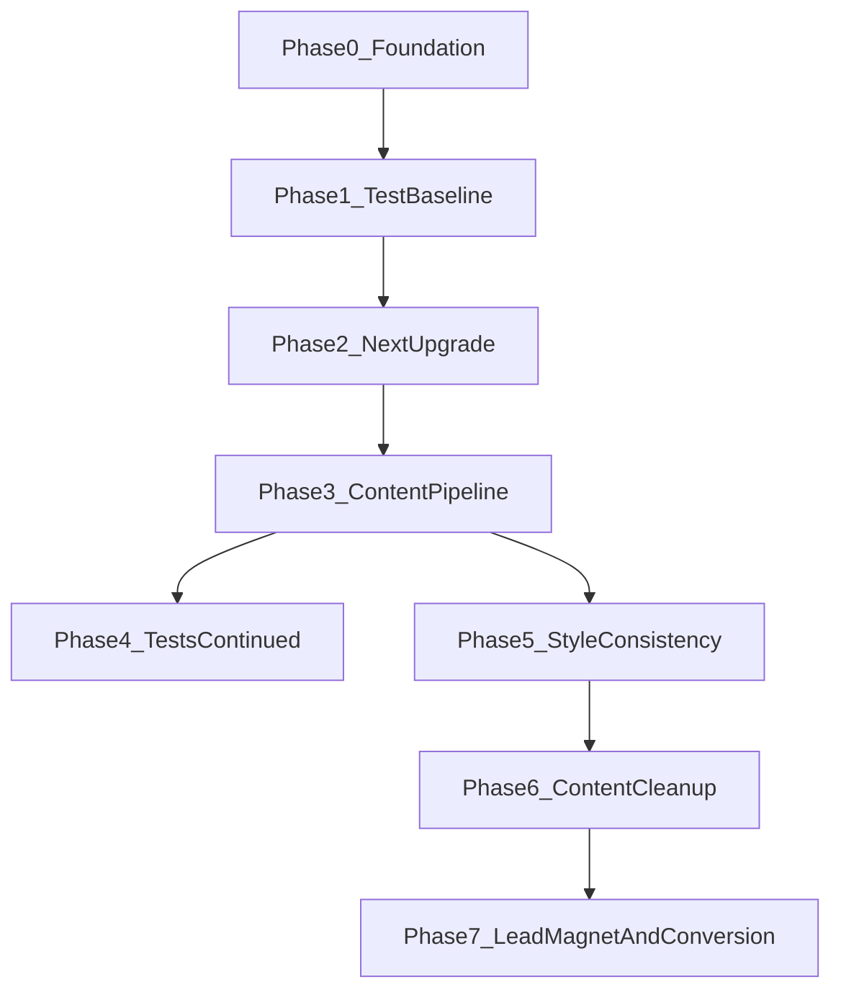

# SLR.com Brand Launch Refinement Plan

## Dependency Graph

## Execution Guardrails

- Work in a dedicated branch after the move (example: `refactor/next14-content-pipeline`)
- Use checkpoint commits after each phase (0, 1, 2, 3, 4, 5, 6, 7) with clear messages
- Do not proceed to next phase until current phase verify checklist passes
- Keep production deploys blocked until Phase 4 CI update is complete
- Keep one rollback point before each high-risk phase (before Phase 2 and before Phase 3)

---

## Phase 0: Foundation (docs first, then move)

Create project-context doc and AGENTS.md while we still have this chat context, commit and push, then clone to a non-OneDrive path.

**Entry Criteria**

- Current repo is accessible and writable in Cursor
- Decisions from this chat are finalized enough to document

**Exit Criteria**

- Context/decisions doc and `AGENTS.md` exist in repo and are pushed
- New non-OneDrive clone opens and runs locally

### 0.1 Create context/decisions doc (do first -- while chat context is live)

- Add `1P/brand-dial-in/YYYYMMDD-context-and-decisions.md` capturing all decisions from this review session:
  - Tech: Replace Contentlayer with custom lib; single content home = `content/blog`; upgrade to Next 14; images in `public/images/blog/`
  - Process: Repo out of OneDrive; keep public; keep PARA in repo
  - Tests: Default to local; fix brittle selectors; add content tests; CI against built branch
  - Style: One token set; align About, blog post, ZAG pillar pages
  - Content: Remove duplicate community page, test-deployment, footer duplication; trim testimonials and redundancy

### 0.2 Add AGENTS.md at repo root (do second -- while chat context is live)

- Project identity (personal brand site, audience = "Alex, the Awakened Technologist", conversion = newsletter + lead magnet)
- Tech stack summary (Next.js 14, TypeScript, Tailwind, gray-matter, Vercel)
- Content home: `content/blog/` with ZEN/ACT/GEM subdirs
- Pointer to `.cursor/rules/` for domain-specific guidance
- Current priorities section (updated after each phase)

### 0.3 Commit, push, and move repo out of OneDrive

- Commit the new docs: context/decisions doc + AGENTS.md
- Push to GitHub so everything is in the remote
- Create target directory (e.g. `C:\Dev\SLR.com`)
- Clone fresh from GitHub: `git clone https://github.com/sheridan-richey/sheridanrichey-brand-ecosystem.git`
- Open the new clone in Cursor; verify `npm run dev` works from `website/`
- Stop using the OneDrive copy for development

---

## Phase 1: Test Baseline (safety net before upgrade)

Fix Playwright config and brittle selectors so E2E runs reliably against local dev. This gives you a working safety net to run after each major change in Phases 2-3.

**Entry Criteria**

- Running from the new non-OneDrive clone
- Project installs and dev server starts

**Exit Criteria**

- Playwright defaults to local base URL
- Baseline E2E suite is green against local server
- Baseline test fixes are committed

### 1.1 Fix Playwright config default

- [playwright.config.js](playwright.config.js): Change `baseURL` default from `https://sheridanrichey.com` to `http://localhost:3000`
- Add a comment or env example: `BASE_URL=https://sheridanrichey.com` for production runs

### 1.2 Fix brittle selectors

- [tests/e2e/links.spec.js](tests/e2e/links.spec.js): Change exact nav link count (`toHaveCount(7)`) to "at least N" or "expected links exist by href"
- [tests/e2e/newsletter.spec.js](tests/e2e/newsletter.spec.js): Align selectors to actual form field names (`name` not `first_name`; `role` not `source`/`cta_source`)
- [tests/e2e/blog.spec.js](tests/e2e/blog.spec.js): Remove or rewrite "categories and filtering" test since client-side filtering doesn't exist

### 1.3 Verify

- Run `npm run dev` in `website/`, then `npm run test:e2e` from repo root
- All existing E2E tests pass against local dev server
- Commit this as a clean baseline

---

## Phase 2: Upgrade Next.js (13.5 -> 14)

**Entry Criteria**

- Phase 1 baseline tests are passing locally
- Rollback checkpoint commit exists before dependency upgrade

**Exit Criteria**

- App builds and runs on Next 14
- Contentlayer dependencies are removed
- Non-content-critical E2E flows still pass

### 2.1 Bump dependencies in [website/package.json](website/package.json)

- `next` -> `^14.2` (latest 14.x)
- `react` / `react-dom` -> `^18.3` (compatible)
- `eslint-config-next` -> `^14.2`
- Remove `contentlayer`, `@contentlayer/source-files`, `next-contentlayer` (removed now since Phase 3 replaces them)

### 2.2 Update config files

- [website/next.config.js](website/next.config.js): Remove `withContentlayer` wrapper; export plain `nextConfig`
- [website/tsconfig.json](website/tsconfig.json): Remove `contentlayer/generated` path alias and `.contentlayer/generated` from `include`
- Delete [website/contentlayer.config.ts](website/contentlayer.config.ts)
- Remove `contentlayer` script from [website/package.json](website/package.json)
- Clean up `.gitignore` (remove `.contentlayer/`)

### 2.3 Stub the content imports (temporary)

- Since Contentlayer is removed, consuming files will break. Create a temporary `website/lib/posts-stub.ts` that exports an empty `allPosts = []` array so the build passes. (Phase 3 replaces this with the real implementation.)
- Update imports in:
  - [website/app/blog/page.tsx](website/app/blog/page.tsx)
  - [website/app/blog/[slug]/page.tsx](website/app/blog/[slug]/page.tsx)
  - [website/components/LatestInsights.tsx](website/components/LatestInsights.tsx)
  - [website/app/contributors/page.tsx](website/app/contributors/page.tsx)

### 2.4 Verify

- `npm install` (clean install)
- `npm run build` passes
- `npm run dev` -- home, blog, about, newsletter pages load (blog will be empty; that's expected with the stub)
- Run E2E tests (from Phase 1 baseline) -- non-blog tests should pass; blog tests may need to tolerate empty state temporarily
- Fix any Next 14 deprecation warnings

---

## Phase 3: Replace Contentlayer with Custom Content Pipeline

**Entry Criteria**

- Next 14 upgrade is stable and committed
- `content/blog` is confirmed as the single content home target

**Exit Criteria**

- Blog data comes from `content/blog` via `lib/posts.ts`
- Blog index and slug pages render correctly
- `website/posts` and sync dependency path are deprecated/removed

### 3.1 Install gray-matter

- `npm install gray-matter` in `website/`

### 3.2 Create `website/lib/posts.ts`

- `getAllPosts()`: Read all `.md` / `.mdx` files from `content/blog/` (repo root, across zen/act/gem subdirs), parse frontmatter with gray-matter, return typed array with: `slug` (derived from filename), `title`, `description`, `date`, `category`, `author`, `tags`, `featured`, `bodyRaw` (raw markdown string)
- `getPostBySlug(slug)`: Return single post or null
- Type: `Post` interface matching the shape currently used
- Sort by date descending by default; featured posts first

### 3.3 Unify content home

- **Single source of truth**: `content/blog/` at repo root
  - Existing posts in `website/posts/*.mdx` are moved to `content/blog/<category>/` (matching their frontmatter category)
  - The OptConnect post (`content/blog/gem/career-transition-optconnect.md`) already lives here; just ensure frontmatter has all required fields
- Remove or deprecate `scripts/sync-content.js` (no longer needed)
- Remove `website/posts/` directory after migration

### 3.4 Update consuming components

Replace stub imports with `import { getAllPosts, getPostBySlug } from '@/lib/posts'`:

- [website/app/blog/page.tsx](website/app/blog/page.tsx): Use `getAllPosts()`; keep same sorting/formatting logic
- [website/app/blog/[slug]/page.tsx](website/app/blog/[slug]/page.tsx): Use `getPostBySlug(params.slug)`; render `post.bodyRaw` with existing ReactMarkdown setup; add `generateStaticParams()` for static builds
- [website/components/LatestInsights.tsx](website/components/LatestInsights.tsx): Use `getAllPosts()` instead of stub
- [website/app/contributors/page.tsx](website/app/contributors/page.tsx): Use `getAllPosts()` for author post counts

### 3.5 Blog images convention

- Create `website/public/images/blog/` directory
- Document convention: images in `public/images/blog/<post-slug>/` referenced in markdown as `/images/blog/<post-slug>/photo.jpg`
- Add this to [website/BLOG_SYSTEM_README.md](website/BLOG_SYSTEM_README.md)

### 3.6 Clean up category list

- In the `Post` type in `lib/posts.ts`, restrict category to: `ZEN`, `ACT`, `GEM`, `ZAG`, `Featured` (drop `Leadership`, `Entrepreneurship`, `Wellness`)
- Update [website/BLOG_SYSTEM_README.md](website/BLOG_SYSTEM_README.md) accordingly

### 3.7 Verify

- `npm run build` passes
- Blog index lists all posts from `content/blog/`
- Individual blog posts render correctly (body, author, tags, category)
- OptConnect post is live at `/blog/career-transition-optconnect`
- Run E2E tests from Phase 1 -- blog tests should now pass with real content

---

## Phase 4: Test Infrastructure (continued)

Now that the content pipeline is live, add tests that lock the new behavior and update CI.

**Entry Criteria**

- Content pipeline is live and serving posts
- Existing E2E suite passes locally after Phase 3

**Exit Criteria**

- New content-pipeline tests are green
- CI validates branch code (not production site state)
- PR test signal is reliable for go/no-go

### 4.1 Add content pipeline tests

- New E2E test: Blog index page has at least 1 post (`article` count > 0)
- New E2E test: Known slug (e.g. `career-transition-optconnect`) loads and shows expected title
- Optional: Unit test for `getAllPosts()` and `getPostBySlug()` (consider adding vitest for this)

### 4.2 Update CI workflow

- [.github/workflows/playwright.yml](.github/workflows/playwright.yml): Build the site from the PR branch, start it (e.g. `npm run build && npx next start &`), then run Playwright against `http://localhost:3000` instead of production

### 4.3 Verify

- `npm run dev` + `npm run test:e2e` passes locally with all new and existing tests
- CI workflow runs correctly on a test PR

---

## Phase 5: Style Consistency

**Entry Criteria**

- Functional stability is confirmed (Phases 1-4 complete)
- Brand token palette is treated as source of truth

**Exit Criteria**

- No mixed token systems remain (`slate/gray/secondary/accent` removed)
- Core pages visually align to one modern style system
- Typography is consistently Manrope via `next/font`

### 5.1 Establish single token set

All pages must use only the brand tokens defined in [website/tailwind.config.js](website/tailwind.config.js):

- Text: `text-phantom` (dark), `text-graphite` (medium), `text-smoke` (light)
- Backgrounds: `bg-light-bg`, `bg-white`, `bg-cloud`
- Borders: `border-smoke`
- Accent: `text-primary-500`, `bg-primary-500`
- Font: `font-manrope` everywhere
- **Never use**: `slate-`*, `gray-`*, `secondary-*`, hardcoded hex like `#279595` or `#6366F1`

### 5.2 Fix About page

- [website/app/about/page.tsx](website/app/about/page.tsx): Replace `secondary-900`/`secondary-600`/`accent-50`/`primary-50` with phantom/graphite/light-bg/primary tokens; add `font-manrope` to all text elements

### 5.3 Fix blog post template

- [website/app/blog/[slug]/page.tsx](website/app/blog/[slug]/page.tsx): Replace all `slate-*` classes with brand tokens; replace `font-heading`/`font-body` with `font-manrope`; replace hardcoded `#279595` with `primary-500` and `#6366F1` with `primary-500` (or remove the indigo)

### 5.4 Fix ZAG pillar pages

- [website/app/zag-matrix/zen/page.tsx](website/app/zag-matrix/zen/page.tsx), [act/page.tsx](website/app/zag-matrix/act/page.tsx), [gem/page.tsx](website/app/zag-matrix/gem/page.tsx): Replace `gray-*` / `slate-*` with brand tokens; add `font-manrope`

### 5.5 Fix shared components

- [website/components/BlogCard.tsx](website/components/BlogCard.tsx): Replace `slate-*` with brand tokens; `font-heading`/`font-body` -> `font-manrope`
- [website/components/ZagMatrixOverview.tsx](website/components/ZagMatrixOverview.tsx): `border-slate-200` -> `border-smoke`

### 5.6 Fix font loading

- [website/app/globals.css](website/app/globals.css): Remove `@import url('https://fonts.googleapis.com/css2?family=Manrope...')` -- the font is already loaded via `next/font` in [website/app/layout.tsx](website/app/layout.tsx)

### 5.7 Verify

- Visual check: Home, About, Blog index, Blog post, ZAG Matrix, ZAG pillar pages, Contact, Newsletter, Resources all use same color/type treatment
- No `slate-`, `gray-`, `secondary-`, `accent-`, or hardcoded hex remaining in `.tsx` files (grep to confirm)

---

## Phase 6: Content Cleanup

**Entry Criteria**

- Style pass is complete and stable
- Redundancy/dead-link removal list is approved

**Exit Criteria**

- Duplicate/unused pages and debug artifacts are removed
- Footer/navigation are simplified and non-redundant
- No dead internal links remain

### 6.1 Remove duplicate community page

- Delete [website/app/zag-collective/page.tsx](website/app/zag-collective/page.tsx) (keep [website/app/community/page.tsx](website/app/community/page.tsx) as the single community page)
- Add a redirect in [website/vercel.json](website/vercel.json): `/zag-collective` -> `/community` (301)
- Update any internal links pointing to `/zag-collective`

### 6.2 Remove test/dev artifacts

- Delete [website/app/test-deployment/page.tsx](website/app/test-deployment/page.tsx) (debug page exposing env vars)
- Delete [website/app/page-backup.tsx](website/app/page-backup.tsx) (unused backup)
- Delete [website/components/NewsletterTest.tsx](website/components/NewsletterTest.tsx) (debug component)

### 6.3 Simplify footer

- [website/components/Footer.tsx](website/components/Footer.tsx): Each destination appears once. Suggested structure:
  - **Content**: Blog, Resources, Newsletter
  - **About**: About, Contact, Speaking
  - **ZAG Matrix**: Framework Overview
  - **Connect**: LinkedIn (remove Twitter if you don't use it)

### 6.4 Fix newsletter naming

- Use "The ZAG Navigator" consistently:
  - [website/app/newsletter/page.tsx](website/app/newsletter/page.tsx): H1 -> "The ZAG Navigator" (not "Join the ZAG Newsletter")
  - CTA buttons site-wide: "Join The ZAG Navigator" or "Subscribe to The ZAG Navigator"

### 6.5 Fix newsletter social proof

- [website/app/newsletter/page.tsx](website/app/newsletter/page.tsx): Remove "What Our Newsletter Subscribers Say" block and "Join 500+ awakened technologists" unless backed by real data. Replace with a short, honest line (e.g. "Join awakened technologists on their transformation journey.")

### 6.6 Trim ZAG Matrix page

- [website/app/zag-matrix/page.tsx](website/app/zag-matrix/page.tsx): Remove "Resources to Support Your Journey" section (three cards that just link to Blog, Newsletter, Tools -- already in nav). Keep the "How It Works" section and the final CTA.

### 6.7 Remove dead links on Resources page

- The following routes don't exist: `/downloads/prompt-architects-toolkit`, `/zag-assessment`, `/downloads/weekly-zag-planner`, `/downloads/executive-transition-checklist`
- Either: (a) remove those items from the Resources page until they exist, or (b) create placeholder pages. Recommend (a) for "less is more" -- keep only the Prompt Architect's Toolkit entry and build its route in Phase 7.

### 6.8 Optional: Trim Contributors

- If only 1-2 contributors, consider merging contributor info into About page and removing [website/app/contributors/page.tsx](website/app/contributors/page.tsx); or keep it but rename section from "Our Team" to "Contributors"

### 6.9 Verify

- All nav links work (no 404s)
- Footer is clean with no duplicate destinations
- ZAG Matrix page is tighter
- Newsletter page is honest and consistent

---

## Phase 7: Lead Magnet and Conversion

**Entry Criteria**

- Clean, stable site after style and cleanup phases
- Newsletter API route is operational in target environment

**Exit Criteria**

- Prompt Toolkit route and download flow work end-to-end
- Blog CTA language is consistent with "The ZAG Navigator"
- Rule/status docs reflect new operating baseline

### 7.1 Wire the Prompt Architect's Toolkit

- Create route `website/app/downloads/prompt-architects-toolkit/page.tsx`
- Page shows toolkit description + requires newsletter signup (email) to unlock the download link
- On submit: call existing `/api/newsletter` with `ctaSource: 'lead_magnet_toolkit'`; on success, show download link (or redirect to PDF in `public/downloads/`)
- Place actual PDF in `website/public/downloads/prompt-architects-toolkit.pdf`

### 7.2 Ensure every blog post ends with newsletter CTA

- In [website/app/blog/[slug]/page.tsx](website/app/blog/[slug]/page.tsx): Verify the bottom CTA includes a direct "Subscribe to The ZAG Navigator" button (already partially there; ensure it's consistent with Phase 5.4 naming)

### 7.3 Update `.cursor/rules/README.md`

- Refresh "Current Project Status" and "Next Priority" to reflect current state after all phases
- Update "Last Updated" date

### 7.4 Verify

- Toolkit page: fill in email -> subscribe -> get download link
- Blog posts: every post ends with ZAG Navigator CTA
- Full site walkthrough: Home -> Blog -> Post -> Newsletter signup -> Toolkit download

---

## Files to delete (summary)

- `website/contentlayer.config.ts`
- `website/posts/` (entire directory, after migrating to `content/blog/`)
- `website/app/test-deployment/page.tsx`
- `website/app/page-backup.tsx`
- `website/components/NewsletterTest.tsx`
- `website/app/zag-collective/page.tsx`

